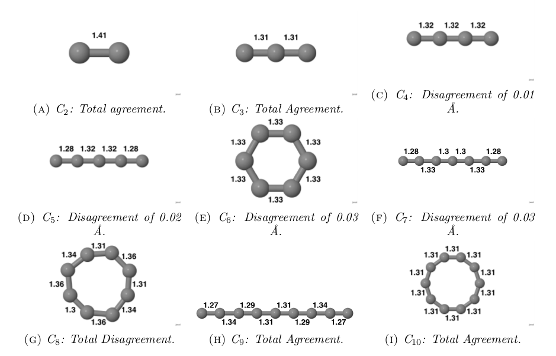

Tight Binding Molecular Dynamics Code
=================================

This is a code to perform tight binding molecular dynamics of carbon structures.

*Figure: Carbon structures equilibrium configurations computed using tbmd.*

Compilation
------------------
#### Commands
    cd tbmd
    make
The binary *tbmd* will be created in the *bin* folder.

#### Dependencies

- libgsl >= 1.6
- libblas (gcc)
- liblapack (gcc)
OR
- mkl (intel)

> **Note**: Parallelization during the Hamiltonian diagonalisation can be achieved by ensuring LAPACK/MKL is compiled with parallel support. The Makefile is prepared to use *gcc* compiler, *LAPACK* and *BLAS* libraries. If you want to use *icc* and *MKL* you must modify it manually yourself.

Running
------------
The code can be ran using the following command:

    ./tbmd -c config -i structure.xyz -o output.dat
    
- **config**: Configuration file.
- **structure.xyz**: The carbon structures to be simulated.
- **output.dat**: Output information of the simulation every time step.

> - More info about the options of the configuration file and on how to build .xyz files can be found in *doc/Manual.pdf*.
> - Examples of a configuration file and .xyz files can be found in *examples*.

Extras
---------
In the *extra* folder a small program to generate nanotubes and graphene sheets is provided. Different chiralities can be specified. To compile and run:

    g++ nanogen.cpp -o nanogen
    ./nanogen

The information to build the nanotube/graphene is provided interactively. A file named *map.xyz* is generated in the same directory with the structure.

 Documentation
----------------------
A report of several calculations done with the program can be found in the *doc* folder as well as a more detailed manual.

>Note: The manual is  a bit outdated with regard of the compiling instructions but it is still useful for check configuration options and input format.

 Contact
-------------
For any comment, doubt or issue write to <eduradical951@gmail.com>.
